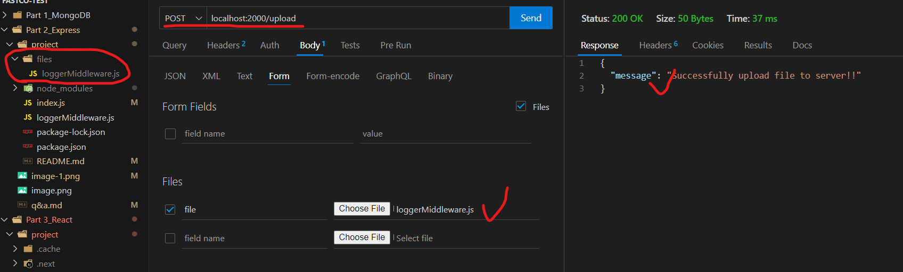

# Part 2: Express

## Create an Express route that returns a list of all users in a MongoDB collection as a JSON response.

```
GET localhost:2000/items
```

Result


## Write an Express middleware function that logs the IP address and timestamp of each incoming request.

- loggerMiddleware

Result


## Create an Express route that allows a user to upload a file to the server and save it to a specified directory.


