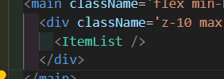
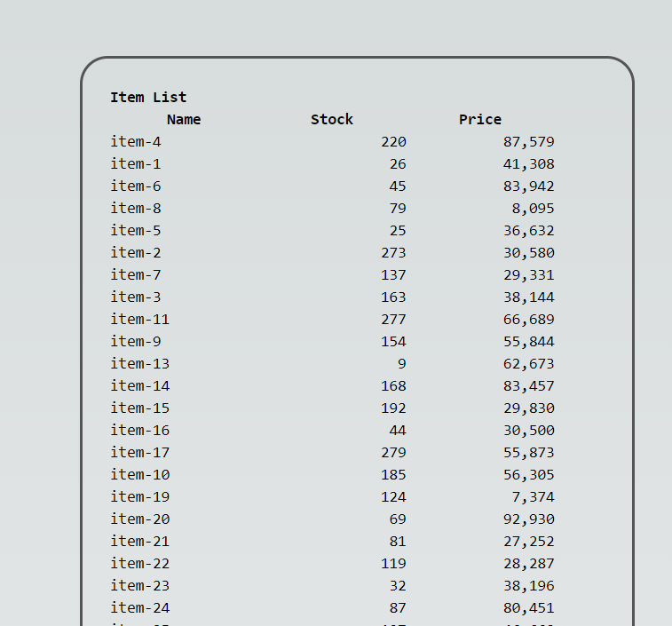
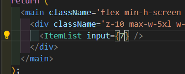
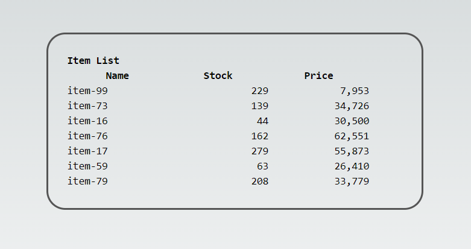

# Part 3: React

## Create a React component that displays a list of items retrieved from an API endpoint.

**Note** : For this task, I run `Part 2_Express` project. Also need to create data items first. So please hit this endpoint **once**.

```
POST localhost:2000/insert/item-part-3
```

React Component

```
ItemList.tsx (without props)
```



Result


## Write a React function that takes a number as input and returns a list of that length, with each item consisting of a random number between 1 and 100.

React Component

```
ItemList.tsx (with props)
```



Result


With function `getNRandomData`.

## Create a React component that is a widget which is like a contact form (Name, Email, Phone)

- already created the widget -> `src/app/components/widgets`. But can't implement it
