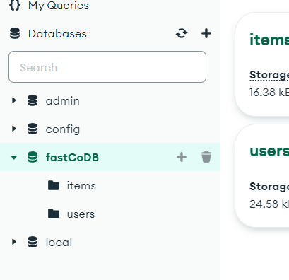
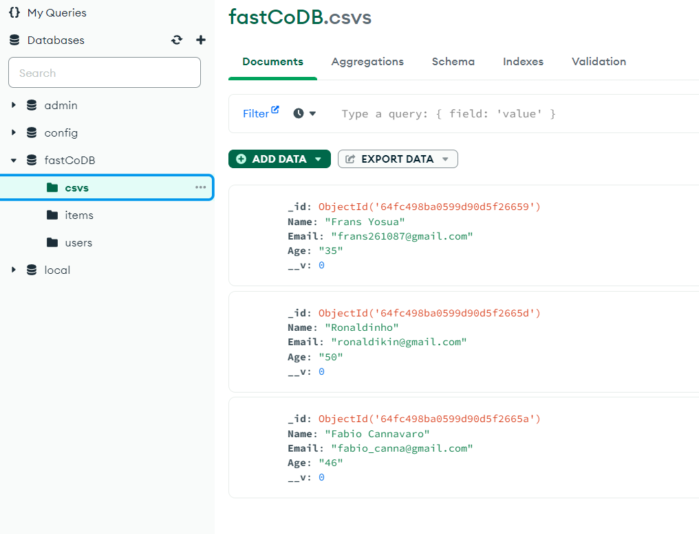
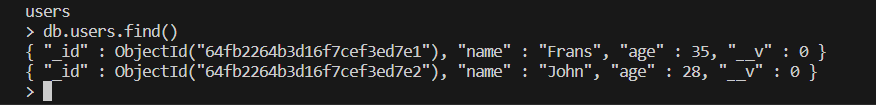
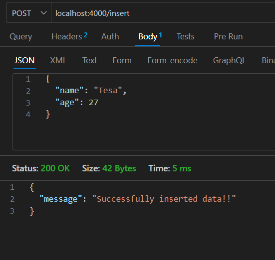
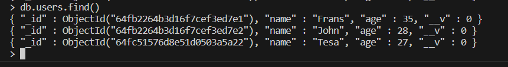
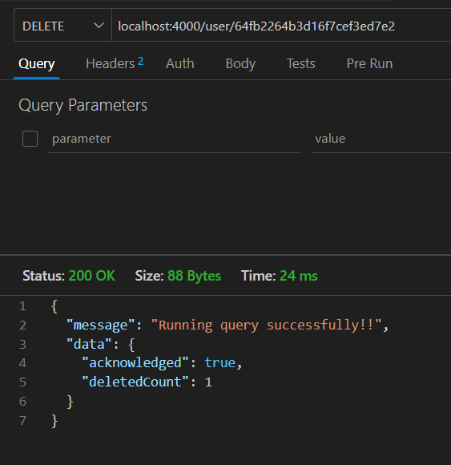
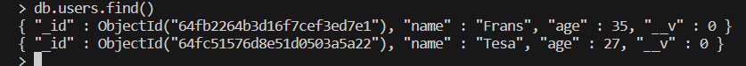
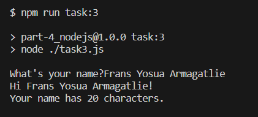

# Part 4: Node.js

## Write a Node.js script that reads a CSV file and inserts the data into a MongoDB collection.

before (only have two collections)


```
npm run read:csv
```

after (csv collection is added)


## Create a Node.js server that allows users to create and delete user accounts, with the account information stored in a MongoDB collection.

- I create express server. Same like Part 2 task.

### To create user account task, I create entrypoint `POST /user`

before


execute


after


### To delete user account task, I create entrypoint `DELETE /user/:id`

before


execute


after


## Write a Node.js function that takes a string as input and returns the number of words in the string.

```
npm run task:3
```


